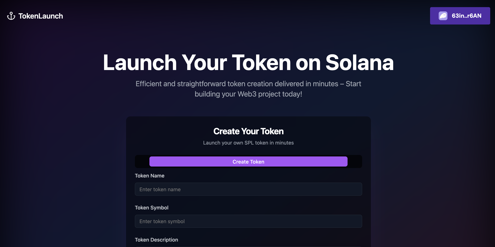

# Solana Token Launchpad

The **Solana Token Launchpad** is a platform where users can effortlessly create and launch their Solana tokens. The platform allows users to provide all necessary details about their tokens, including images and metadata, and stores this information on IPFS using Pinata.

## Features

- **Token Creation**: Users can define all the details of their Solana token, such as name, symbol, supply, and more.
- **Metadata Management**: Automatically stores token metadata (including images) securely on IPFS using Pinata.
- **Solana Integration**: Leverages the Solana blockchain for token deployment.
- **Modern Frontend**: Built with Vite and React for a fast and responsive user experience.

## Tech Stack

- **Frontend**: Vite, React, and TailwindCSS (or your preferred CSS framework).
- **Blockchain**: Solana.
- **Storage**: IPFS (via Pinata).
- **API**: Integration with Solana RPC and IPFS Pinning Service.

## Getting Started

### Prerequisites

Before running this project, ensure you have the following installed:

- Node.js (v16 or later)
- Yarn or npm
- A Solana wallet (e.g., Phantom)
- A Pinata account for IPFS
